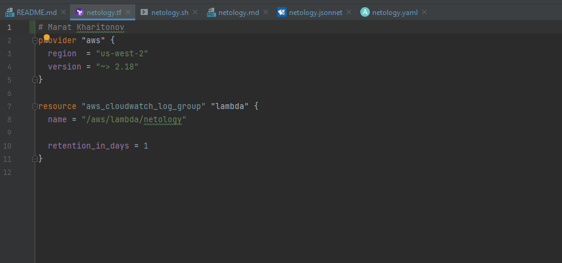
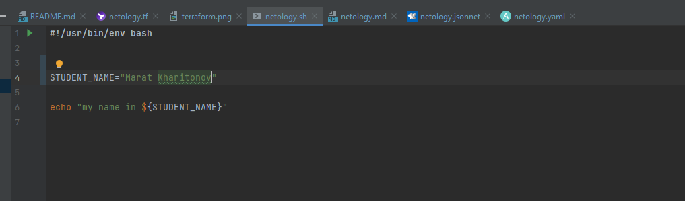
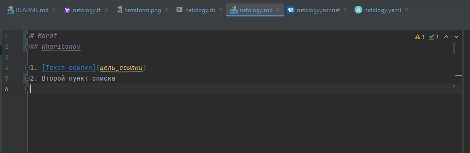
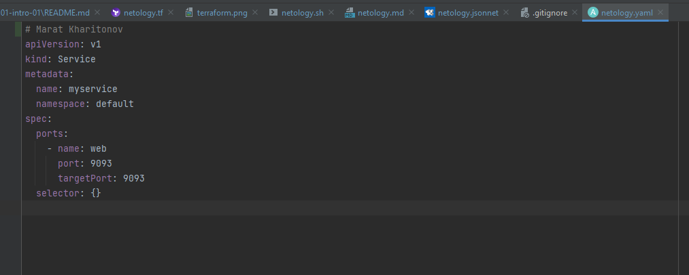
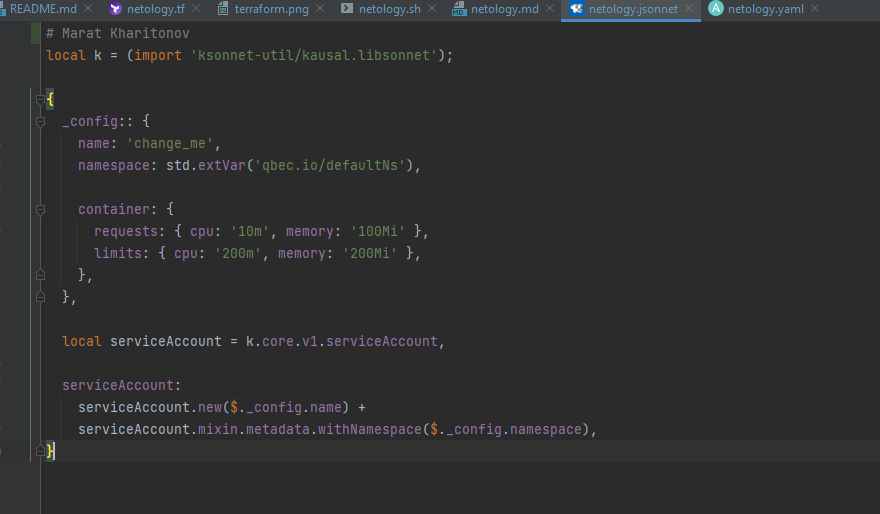

# Домашнее задание к занятию «1.1. Введение в DevOps»

## Задание №1 - Подготовка рабочей среды

- Terraform: 

- Bash: 

- Markdown: 

- Yaml: 

- Jsonnet: 

## Задание №2 - Описание жизненного цикла задачи (разработки нового функционала)

Чтобы лучше понимать предназначение дальнейших инструментов, с которыми нам предстоит работать, давайте 
составим схему жизненного цикла задачи в идеальном для вас случае.

### Описание истории

Представьте, что вы работаете в стартапе, который запустил интернет-магазин. Ваш интернет-магазин достаточно успешно развивался, и вот пришло время налаживать процессы: у вас стало больше конечных клиентов, менеджеров и разработчиков.Сейчас от клиентов вам приходят задачи, связанные с разработкой нового функционала. Задач много, и все они требуют выкладки на тестовые среды, одобрения тестировщика, проверки менеджером перед показом клиенту. В случае необходимости, вам будет необходим откат изменений. 

### Решение задачи

Вам необходимо описать процесс решения задачи в соответствии с жизненным циклом разработки программного обеспечения. Использование какого-либо конкретного метода разработки не обязательно. Для решения главное - прописать по пунктам шаги решения задачи (релизации в конечный результат) с участием менеджера, разработчика (или команды разработчиков), тестировщика (или команды тестировщиков) и себя как DevOps-инженера. 

1. Задача (требования) падают руководителю проекта.
2. РП проектирует решение и ставит задачу разработчикам.
3. Разработчики пилят решение. 
4. Решение передаётся тестировщикам.
5. Если тесты провалены, то возврат к п.3. 
6. DevOps раскатывают решение на препрод.
7. РП производит ревью. Если неудачно, то вовзврат к п.3.
8. DevOps раскатывает на прод.
9. Демонстрация заказчику. Если неудачно, то возврат к п.3.
10. Мониторинг. Мониторинг. Мониторинг.
 
