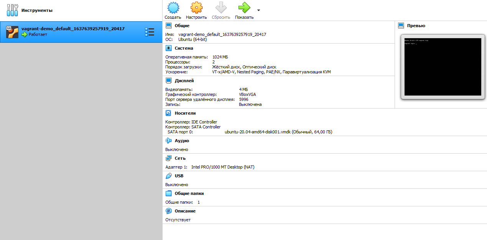

# Домашнее задание к занятию "3.1. Работа в терминале, лекция 1"


4. С помощью базового файла конфигурации запустите Ubuntu 20.04 в VirtualBox посредством Vagrant:

    * Создайте директорию, в которой будут храниться конфигурационные файлы Vagrant. В ней выполните `vagrant init`. Замените содержимое Vagrantfile по умолчанию следующим:

        ```bash
        Vagrant.configure("2") do |config|
            config.vm.box = "bento/ubuntu-20.04"
        end
        ```

    * Выполнение в этой директории `vagrant up` установит провайдер VirtualBox для Vagrant, скачает необходимый образ и запустит виртуальную машину.

    * `vagrant suspend` выключит виртуальную машину с сохранением ее состояния (т.е., при следующем `vagrant up` будут запущены все процессы внутри, которые работали на момент вызова suspend), `vagrant halt` выключит виртуальную машину штатным образом.

5. Ознакомьтесь с графическим интерфейсом VirtualBox, посмотрите как выглядит виртуальная машина, которую создал для вас Vagrant, какие аппаратные ресурсы ей выделены. Какие ресурсы выделены по-умолчанию?



6. Ознакомьтесь с возможностями конфигурации VirtualBox через Vagrantfile: [документация](https://www.vagrantup.com/docs/providers/virtualbox/configuration.html). Как добавить оперативной памяти или ресурсов процессора виртуальной машине?

Отредактировав Vagrantfile и добавив в него следующие строки
```bash
  config.vm.provider "virtualbox" do |vb|
     vb.cpus = "4"
     vb.memory = "1024"
  end
```

Чтобы получилось следующее:

```bash
Vagrant.configure("2") do |config|
    config.vm.box = "bento/ubuntu-20.04"
    config.vm.provider "virtualbox" do |vb|
      vb.cpus = "4"
      vb.memory = "1024"
    end
end
```

7. Команда `vagrant ssh` из директории, в которой содержится Vagrantfile, позволит вам оказаться внутри виртуальной машины без каких-либо дополнительных настроек. Попрактикуйтесь в выполнении обсуждаемых команд в терминале Ubuntu.

8. Ознакомиться с разделами `man bash`, почитать о настройках самого bash:

* какой переменной можно задать длину журнала `history`, и на какой строчке manual это описывается?

На 862 строке.  export HISTSIZE=100

* что делает директива `ignoreboth` в bash?

Не сохраняет строки начинающиеся с пробела и совпадающие с последней командой

10. В каких сценариях использования применимы скобки `{}` и на какой строчке `man bash` это описано?

В сценариях использования множеств. Например, создать N файлов, указав некий диапазон. Описано на 257 строке.

11. Основываясь на предыдущем вопросе, как создать однократным вызовом `touch` 100000 файлов? А получилось ли создать 300000? Если нет, то почему?

```bash
touch {1..100000}.txt
``` 
что эквивалентно 
```bash
touch 1.txt 2.txt ... 99999.txt 100000.txt
```

300000 файлов создать не получится, так как в системе имеется ограничение на максимальную длину команды.

12. В man bash поищите по `/\[\[`. Что делает конструкция `[[ -d /tmp ]]`

Возвращает 1, если существует каталог /tmp

13. Основываясь на знаниях о просмотре текущих (например, PATH) и установке новых переменных; командах, которые мы рассматривали, добейтесь в выводе type -a bash в виртуальной машине наличия первым пунктом в списке:

     ```bash
     bash is /tmp/new_path_directory/bash
     bash is /usr/local/bin/bash
     bash is /bin/bash
     ```

     (прочие строки могут отличаться содержимым и порядком)
     В качестве ответа приведите команды, которые позволили вам добиться указанного вывода или соответствующие скриншоты.

 ```bash
vagrant@vagrant:~$ mkdir /tmp/new_path_directory
vagrant@vagrant:~$ cp /bin/bash /tmp/new_path_directory/
vagrant@vagrant:~$ echo $PATH
/usr/local/sbin:/usr/local/bin:/usr/sbin:/usr/bin:/sbin:/bin:/usr/games:/usr/local/games:/snap/bin
vagrant@vagrant:~$ export PATH=/usr/local/sbin:/usr/local/bin:/usr/sbin:/usr/bin:/sbin:/bin:/usr/games:/usr/local/games:/snap/bin:/tmp/new_path_directory
vagrant@vagrant:~$ type -a bash
bash is /usr/bin/bash
bash is /bin/bash
bash is /tmp/new_path_directory/bash
vagrant@vagrant:~$
 ```


15. Чем отличается планирование команд с помощью `batch` и `at`?

`at` выполняет команду в назначенное время, а `batch` тогда, когда позволяет нагрузка системы `executes commands when system load levels permit; in other words, when the load  average  drops  below 1.5`

17. Завершите работу виртуальной машины чтобы не расходовать ресурсы компьютера и/или батарею ноутбука.
`vargrant halt`


---