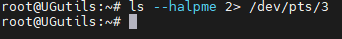
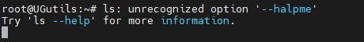

# Домашнее задание к занятию "3.2. Работа в терминале, лекция 2"

1. Какого типа команда `cd`? Попробуйте объяснить, почему она именно такого типа; опишите ход своих мыслей, если считаете что она могла бы быть другого типа.

`cd is a shell builtin`

cd является встроенной командой оболочки bash и не имеет альтернантивного представления, не зависит от PATH.

2. Какая альтернатива без pipe команде `grep <some_string> <some_file> | wc -l`? `man grep` поможет в ответе на этот вопрос. Ознакомьтесь с [документом](http://www.smallo.ruhr.de/award.html) о других подобных некорректных вариантах использования pipe.

`grep -c <some_string> <some_file>`

3. Какой процесс с PID `1` является родителем для всех процессов в вашей виртуальной машине Ubuntu 20.04?

`systemd`

4. Как будет выглядеть команда, которая перенаправит вывод stderr `ls` на другую сессию терминала?

`ls --halpme 2> /dev/pts3`






6. Получится ли одновременно передать команде файл на stdin и вывести ее stdout в другой файл? Приведите работающий пример.

`root@UGutils:~# echo "hello netology" > 1.txt`
`root@UGutils:~# cat < 1.txt > 2.txt`
`root@UGutils:~# cat 2.txt`
`hello netology`

6. Получится ли вывести находясь в графическом режиме данные из PTY в какой-либо из эмуляторов TTY? Сможете ли вы наблюдать выводимые данные?

Да, например `cat 1.txt > /dev/tty1`

7. Выполните команду `bash 5>&1`. К чему она приведет? Что будет, если вы выполните `echo netology > /proc/$$/fd/5`? Почему так происходит?

Назначение перенаправление дескриптора 5 в stdout.

Происходит перенаправление потока данных из дескриптора 5 в stdout.

Аналог команды:  `echo netology >&5`

8. Получится ли в качестве входного потока для pipe использовать только stderr команды, не потеряв при этом отображение stdout на pty? Напоминаем: по умолчанию через pipe передается только stdout команды слева от `|` на stdin команды справа.
Это можно сделать, поменяв стандартные потоки местами через промежуточный новый дескриптор, который вы научились создавать в предыдущем вопросе.

```bash
root@docker169:~# (ls && ls --123) 3>&1 1>&2 2>&3 | wc -l
1gb_pages.sh  SecLists  agent-stack.yml  docker-jitsi-meet-stable-6433  graphana  librespeed  lists  patator  prometheus  stable-6433.zip  traefik
2
```

10. Что выведет команда `cat /proc/$$/environ`? Как еще можно получить аналогичный по содержанию вывод?

Переменные среды для текущего процесса (bash)
 
`LANG=CINVOCATION_ID=84d877d787d547dabf39bc39b3b8ce6cTERM=linuxJOURNAL_STREAM=8:22243182HOME=/rootSHELL=/bin/bashUSER=rootLOGNAME=rootPATH=/usr/local/sbin:/usr/local/bin:/usr/sbin:/usr/bin:/sbin:/bin:/usr/games:/usr/local/games:/snap/binMOTD_SHOWN=pamMAIL=/var/mail/rootHUSHLOGIN=FALSE`

Аналогичный вывод можно получить с помощью команды `env`

11. Используя `man`, опишите что доступно по адресам `/proc/<PID>/cmdline`, `/proc/<PID>/exe`.

`cmdline` содержит в себе командную строку процесса, если это не зомби-процесс.
`exe` является символической ссылкой на полный путь процесса.

12. Узнайте, какую наиболее старшую версию набора инструкций SSE поддерживает ваш процессор с помощью `/proc/cpuinfo`.

`cat /proc/cpuinfo | grep sse`

sse4_2

13. При открытии нового окна терминала и `vagrant ssh` создается новая сессия и выделяется pty. Это можно подтвердить командой `tty`, которая упоминалась в лекции 3.2. Однако:

     ```bash
     vagrant@netology1:~$ ssh localhost 'tty'
     not a tty
     ```

     Почитайте, почему так происходит, и как изменить поведение.

Если не ошибаюсь, то при SSH подключении ожидается пользователь, не другой процесс, изменяется поведение добавлением `-t` к команде:
```bash
vagrant@vagrant:~$ ssh -t localhost 'tty'
vagrant@localhost's password:
/dev/pts/1
Connection to localhost closed.
```

15. Бывает, что есть необходимость переместить запущенный процесс из одной сессии в другую. Попробуйте сделать это, воспользовавшись `reptyr`. Например, так можно перенести в `screen` процесс, который вы запустили по ошибке в обычной SSH-сессии.

Запуск `top` в одной SSH сессии. В другой узнать номер процесса `ps -a | grep top`

`reptyr PID`


16. `sudo echo string > /root/new_file` не даст выполнить перенаправление под обычным пользователем, так как перенаправлением занимается процесс shell'а, который запущен без `sudo` под вашим пользователем. Для решения данной проблемы можно использовать конструкцию `echo string | sudo tee /root/new_file`. Узнайте что делает команда `tee` и почему в отличие от `sudo echo` команда с `sudo tee` будет работать.

tee считывает stdin и передаёт его в stdout.
 
 ---