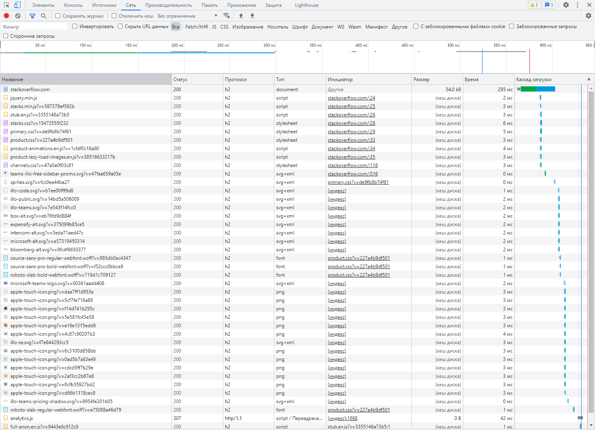

# Домашнее задание к занятию "3.6. Компьютерные сети, лекция 1"

1. Работа c HTTP через телнет.
- Подключитесь утилитой телнет к сайту stackoverflow.com
`telnet stackoverflow.com 80`
- отправьте HTTP запрос
```bash
GET /questions HTTP/1.0
HOST: stackoverflow.com
[press enter]
[press enter]
```
- В ответе укажите полученный HTTP код, что он означает?
> Код 301 означающий постоянный редирект.

2.Повторите задание 1 в браузере, используя консоль разработчика F12.
- откройте вкладку `Network`
- отправьте запрос http://stackoverflow.com
- найдите первый ответ HTTP сервера, откройте вкладку `Headers`
- укажите в ответе полученный HTTP код.
- проверьте время загрузки страницы, какой запрос обрабатывался дольше всего?
- приложите скриншот консоли браузера в ответ.

> 
>
> Код 200, дольше всего обрабатывался первый GET запрос.

3. Какой IP адрес у вас в интернете?
```bash
root@vagrant:/home/vagrant# curl ifconfig.io
46.188.43.238
```
4. Какому провайдеру принадлежит ваш IP адрес? Какой автономной системе AS? Воспользуйтесь утилитой `whois`
```bash
root@vagrant:/home/vagrant# whois 46.188.43.238
% This is the RIPE Database query service.
% The objects are in RPSL format.
%
% The RIPE Database is subject to Terms and Conditions.
% See http://www.ripe.net/db/support/db-terms-conditions.pdf

% Note: this output has been filtered.
%       To receive output for a database update, use the "-B" flag.

% Information related to '46.188.0.0 - 46.188.63.255'

% Abuse contact for '46.188.0.0 - 46.188.63.255' is 'abuse@almatel.ru'

inetnum:        46.188.0.0 - 46.188.63.255
netname:        NET-2COM
descr:          2COM Co ltd.
country:        RU
admin-c:        AR16536-RIPE
tech-c:         AR16536-RIPE
status:         ASSIGNED PA
mnt-by:         MNT-2COM
mnt-lower:      MNT-2COM
mnt-routes:     MNT-2COM
created:        2010-11-29T10:18:30Z
last-modified:  2016-05-19T20:57:31Z
source:         RIPE

role:           Abuse-C Role
nic-hdl:        AR16536-RIPE
abuse-mailbox:  abuse@almatel.ru
mnt-by:         MNT-2COM
address:        2COM Co Ltd
address:        Avtomobilniy proezd 4
address:        109029
address:        Moscow
address:        RUSSIAN FEDERATION
created:        2013-12-18T14:35:34Z
last-modified:  2020-01-29T12:41:14Z
source:         RIPE # Filtered

% Information related to '46.188.0.0/17AS8334'

route:          46.188.0.0/17
descr:          Moscow
descr:          Russia
descr:          2COM Co ltd.
origin:         AS8334
mnt-by:         MNT-2COM
created:        2010-11-25T08:46:05Z
last-modified:  2010-11-25T08:46:05Z
source:         RIPE

% This query was served by the RIPE Database Query Service version 1.102.1 (ANGUS)

```
5. Через какие сети проходит пакет, отправленный с вашего компьютера на адрес 8.8.8.8? Через какие AS? Воспользуйтесь утилитой `traceroute`
```bash
root@vagrant:/home/vagrant# traceroute -AIn 192.168.2.1
traceroute to 192.168.2.1 (192.168.2.1), 30 hops max, 60 byte packets
 1  10.0.2.2 [*]  0.219 ms  0.147 ms  0.486 ms
 2  192.168.1.1 [*]  0.971 ms  0.928 ms  0.879 ms
 3  192.168.2.1 [*]  14.900 ms  14.806 ms  14.761 ms
root@vagrant:/home/vagrant# traceroute -AIn 8.8.8.8
traceroute to 8.8.8.8 (8.8.8.8), 30 hops max, 60 byte packets
 1  10.0.2.2 [*]  0.735 ms  0.654 ms  0.610 ms
 2  192.168.1.1 [*]  1.265 ms  1.124 ms  1.081 ms
 3  46.188.43.2 [AS8334]  2.084 ms  2.038 ms  1.996 ms
 4  80.253.16.197 [AS39153]  2.030 ms  2.186 ms  2.144 ms
 5  80.253.16.81 [AS39153]  2.444 ms  2.400 ms  2.357 ms
 6  108.170.250.129 [AS15169]  3.041 ms  3.477 ms  3.634 ms
 7  108.170.250.146 [AS15169]  2.461 ms  3.328 ms  3.126 ms
 8  * * *
 9  216.239.43.20 [AS15169]  19.307 ms  19.052 ms  21.429 ms
10  142.250.56.13 [AS15169]  16.854 ms  16.812 ms  16.766 ms
11  * * *
12  * * *
13  * * *
14  * * *
15  * * *
16  * * *
17  * * *
18  * * *
19  * * *
20  8.8.8.8 [AS15169]  19.277 ms  19.901 ms  19.695 ms
```
6. Повторите задание 5 в утилите `mtr`. На каком участке наибольшая задержка - delay?

```bash
mtr -nz 8.8.8.8
vagrant (10.0.2.15)                                                                                                                                                                                                                               2021-12-20T05:22:21+0000
Keys:  Help   Display mode   Restart statistics   Order of fields   quit
                                                                                                                                                                                                                                  Packets               Pings
 Host                                                                                                                                                                                                                           Loss%   Snt   Last   Avg  Best  Wrst StDev
 1. AS???    10.0.2.2                                                                                                                                                                                                            0.0%    25    0.3   1.0   0.3  11.4   2.2
 2. AS???    192.168.1.1                                                                                                                                                                                                         0.0%    25    1.6   1.7   0.8   4.9   1.0
 3. AS8334   46.188.43.2                                                                                                                                                                                                         0.0%    25    2.1   2.1   1.9   2.5   0.2
 4. AS39153  80.253.16.197                                                                                                                                                                                                       0.0%    25    2.3   2.7   1.8  10.2   1.7
 5. AS39153  80.253.16.81                                                                                                                                                                                                        0.0%    25    3.7   2.8   2.3   4.7   0.5
 6. AS15169  108.170.250.129                                                                                                                                                                                                     0.0%    25    3.6   3.8   3.2   6.2   0.7
 7. AS15169  108.170.250.146                                                                                                                                                                                                     0.0%    25    2.7   6.7   2.4  29.3   7.4
 8. AS15169  209.85.249.158                                                                                                                                                                                                     52.0%    25   18.7  21.0  17.9  38.6   5.8
 9. AS15169  216.239.43.20                                                                                                                                                                                                       0.0%    25   17.1  22.7  17.0  60.1  10.9
10. AS15169  142.250.56.13                                                                                                                                                                                                       0.0%    25   17.1  17.4  16.8  20.2   0.7
11. (waiting for reply)
12. (waiting for reply)
13. (waiting for reply)
14. (waiting for reply)
15. (waiting for reply)
16. (waiting for reply)
17. (waiting for reply)
18. (waiting for reply)
19. (waiting for reply)
20. AS15169  8.8.8.8                                                                                                                                                                                                             0.0%    24   23.7  20.3  19.4  23.7   1.2

```
> Наибольшая задержка на участке 8.
>
7. Какие DNS сервера отвечают за доменное имя dns.google? Какие A записи? воспользуйтесь утилитой `dig`
```bash
root@vagrant:/home/vagrant# dig dns.google

; <<>> DiG 9.16.1-Ubuntu <<>> dns.google
;; global options: +cmd
;; Got answer:
;; ->>HEADER<<- opcode: QUERY, status: NOERROR, id: 62679
;; flags: qr rd ra; QUERY: 1, ANSWER: 2, AUTHORITY: 0, ADDITIONAL: 1

;; OPT PSEUDOSECTION:
; EDNS: version: 0, flags:; udp: 65494
;; QUESTION SECTION:
;dns.google.                    IN      A

;; ANSWER SECTION:
dns.google.             693     IN      A       8.8.4.4
dns.google.             693     IN      A       8.8.8.8

;; Query time: 0 msec
;; SERVER: 127.0.0.53#53(127.0.0.53)
;; WHEN: Mon Dec 20 05:23:29 UTC 2021
;; MSG SIZE  rcvd: 71

```
> Записи 8.8.8.8 и 8.8.4.4

8. Проверьте PTR записи для IP адресов из задания 7. Какое доменное имя привязано к IP? воспользуйтесь утилитой `dig`

```bash
root@vagrant:/home/vagrant# dig -x 8.8.8.8

; <<>> DiG 9.16.1-Ubuntu <<>> -x 8.8.8.8
;; global options: +cmd
;; Got answer:
;; ->>HEADER<<- opcode: QUERY, status: NOERROR, id: 31599
;; flags: qr rd ra; QUERY: 1, ANSWER: 1, AUTHORITY: 0, ADDITIONAL: 1

;; OPT PSEUDOSECTION:
; EDNS: version: 0, flags:; udp: 65494
;; QUESTION SECTION:
;8.8.8.8.in-addr.arpa.          IN      PTR

;; ANSWER SECTION:
8.8.8.8.in-addr.arpa.   6601    IN      PTR     dns.google.

;; Query time: 0 msec
;; SERVER: 127.0.0.53#53(127.0.0.53)
;; WHEN: Mon Dec 20 05:25:46 UTC 2021
;; MSG SIZE  rcvd: 73

root@vagrant:/home/vagrant# dig -x 8.8.4.4

; <<>> DiG 9.16.1-Ubuntu <<>> -x 8.8.4.4
;; global options: +cmd
;; Got answer:
;; ->>HEADER<<- opcode: QUERY, status: NOERROR, id: 57163
;; flags: qr rd ra; QUERY: 1, ANSWER: 1, AUTHORITY: 0, ADDITIONAL: 1

;; OPT PSEUDOSECTION:
; EDNS: version: 0, flags:; udp: 65494
;; QUESTION SECTION:
;4.4.8.8.in-addr.arpa.          IN      PTR

;; ANSWER SECTION:
4.4.8.8.in-addr.arpa.   80870   IN      PTR     dns.google.

;; Query time: 8 msec
;; SERVER: 127.0.0.53#53(127.0.0.53)
;; WHEN: Mon Dec 20 05:25:53 UTC 2021
;; MSG SIZE  rcvd: 73

```
