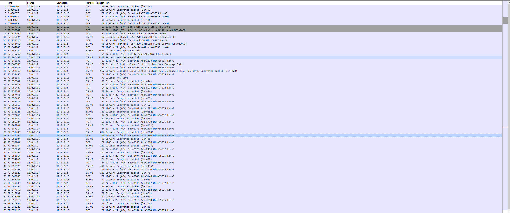

# Домашнее задание к занятию "3.9. Элементы безопасности информационных систем"

1. Установите Bitwarden плагин для браузера. Зарегестрируйтесь и сохраните несколько паролей.
> Установлено.
2. Установите Google authenticator на мобильный телефон. Настройте вход в Bitwarden акаунт через Google authenticator OTP.
> Сделано.
3. Установите apache2, сгенерируйте самоподписанный сертификат, настройте тестовый сайт для работы по HTTPS.
```bash
`vagrant@vagrant:~$ sudo openssl req -x509 -nodes -days 365 -newkey rsa:2048 \-keyout /etc/ssl/private/apache-selfsigned.key \-out /etc/ssl/certs/apache-selfsigned.crt \-subj "/C=RU/ST=Moscow/L=Moscow/O=Company Name/OU=Org/CN=test.com"
Generating a RSA private key
.........+++++
.............+++++
writing new private key to '/etc/ssl/private/apache-selfsigned.key'
-----
vagrant@vagrant:~$ sudo nano /etc/apache2/sites-available/test.com.conf
vagrant@vagrant:~$ sudo mkdir /var/www/test
vagrant@vagrant:~$ sudo nano /var/www/test/index.html
vagrant@vagrant:~$ sudo a2ensite test.com.conf
Enabling site test.com.
To activate the new configuration, you need to run:
  systemctl reload apache2
vagrant@vagrant:~$ sudo apache2ctl configtest
Syntax OK
vagrant@vagrant:~$ sudo systemctl reload apache2
vagrant@vagrant:~$ curl https://test.com`
```
4. Проверьте на TLS уязвимости произвольный сайт в интернете (кроме сайтов МВД, ФСБ, МинОбр, НацБанк, РосКосмос, РосАтом, РосНАНО и любых госкомпаний, объектов КИИ, ВПК ... и тому подобное).
```bash
root@vagrant:/home/vagrant# git clone --depth 1 https://github.com/drwetter/testssl.sh.git
Cloning into 'testssl.sh'...
remote: Enumerating objects: 100, done.
remote: Counting objects: 100% (100/100), done.
remote: Compressing objects: 100% (93/93), done.
remote: Total 100 (delta 14), reused 23 (delta 6), pack-reused 0
Receiving objects: 100% (100/100), 8.55 MiB | 7.30 MiB/s, done.
Resolving deltas: 100% (14/14), done.
root@vagrant:/home/vagrant# cd testssl.sh/
root@vagrant:/home/vagrant/testssl.sh# ./testssl.sh -U --sneaky https://google.com

###########################################################
    testssl.sh       3.1dev from https://testssl.sh/dev/
    (2201a28 2021-12-13 18:24:34 -- )

      This program is free software. Distribution and
             modification under GPLv2 permitted.
      USAGE w/o ANY WARRANTY. USE IT AT YOUR OWN RISK!

       Please file bugs @ https://testssl.sh/bugs/

###########################################################

 Using "OpenSSL 1.0.2-chacha (1.0.2k-dev)" [~183 ciphers]
 on vagrant:./bin/openssl.Linux.x86_64
 (built: "Jan 18 17:12:17 2019", platform: "linux-x86_64")


Testing all IPv4 addresses (port 443): 209.85.233.113 209.85.233.138 209.85.233.139 209.85.233.101 209.85.233.102 209.85.233.100
----------------------------------------------------------------------------------------------------------------------------------------------------------------------------------
 Start 2021-12-20 06:45:53        -->> 209.85.233.113:443 (google.com) <<--

 Further IP addresses:   209.85.233.100 209.85.233.102 209.85.233.101 209.85.233.139 209.85.233.138 2a00:1450:4010:c03::65 2a00:1450:4010:c03::71 2a00:1450:4010:c03::8a 2a00:1450:4010:c03::8b
 rDNS (209.85.233.113):  lr-in-f113.1e100.net.
 Service detected:       HTTP


 Testing vulnerabilities

 Heartbleed (CVE-2014-0160)                not vulnerable (OK), no heartbeat extension
 CCS (CVE-2014-0224)                       not vulnerable (OK)
 Ticketbleed (CVE-2016-9244), experiment.  not vulnerable (OK)
 ROBOT                                     not vulnerable (OK)
 Secure Renegotiation (RFC 5746)           supported (OK)
 Secure Client-Initiated Renegotiation     not vulnerable (OK)
 CRIME, TLS (CVE-2012-4929)                not vulnerable (OK)
 BREACH (CVE-2013-3587)                    no gzip/deflate/compress/br HTTP compression (OK)  - only supplied "/" tested
 POODLE, SSL (CVE-2014-3566)               not vulnerable (OK)
 TLS_FALLBACK_SCSV (RFC 7507)              Downgrade attack prevention supported (OK)
 SWEET32 (CVE-2016-2183, CVE-2016-6329)    VULNERABLE, uses 64 bit block ciphers
 FREAK (CVE-2015-0204)                     not vulnerable (OK)
 DROWN (CVE-2016-0800, CVE-2016-0703)      not vulnerable on this host and port (OK)
                                           make sure you don't use this certificate elsewhere with SSLv2 enabled services
                                           https://censys.io/ipv4?q=C0526710FF20FF6476E70C05AF6343489F58BEC0AEF0E9C9F9F90B0A4A1B5936 could help you to find out
 LOGJAM (CVE-2015-4000), experimental      not vulnerable (OK): no DH EXPORT ciphers, no DH key detected with <= TLS 1.2
 BEAST (CVE-2011-3389)                     TLS1: ECDHE-ECDSA-AES128-SHA ECDHE-ECDSA-AES256-SHA ECDHE-RSA-AES128-SHA ECDHE-RSA-AES256-SHA AES128-SHA AES256-SHA DES-CBC3-SHA
                                           VULNERABLE -- but also supports higher protocols  TLSv1.1 TLSv1.2 (likely mitigated)
 LUCKY13 (CVE-2013-0169), experimental     potentially VULNERABLE, uses cipher block chaining (CBC) ciphers with TLS. Check patches
 Winshock (CVE-2014-6321), experimental    not vulnerable (OK)
 RC4 (CVE-2013-2566, CVE-2015-2808)        no RC4 ciphers detected (OK)


 Done 2021-12-20 06:47:15 [  84s] -->> 209.85.233.113:443 (google.com) <<--

----------------------------------------------------------------------------------------------------------------------------------------------------------------------------------
 Start 2021-12-20 06:47:15        -->> 209.85.233.138:443 (google.com) <<--

 Further IP addresses:   209.85.233.100 209.85.233.102 209.85.233.101 209.85.233.139 209.85.233.113 2a00:1450:4010:c03::65 2a00:1450:4010:c03::71 2a00:1450:4010:c03::8a 2a00:1450:4010:c03::8b
 rDNS (209.85.233.138):  lr-in-f138.1e100.net.
 Service detected:       HTTP


 Testing vulnerabilities

 Heartbleed (CVE-2014-0160)                not vulnerable (OK), no heartbeat extension
 CCS (CVE-2014-0224)                       not vulnerable (OK)
 Ticketbleed (CVE-2016-9244), experiment.  not vulnerable (OK)
 ROBOT                                     not vulnerable (OK)
 Secure Renegotiation (RFC 5746)           supported (OK)
 Secure Client-Initiated Renegotiation     not vulnerable (OK)
 CRIME, TLS (CVE-2012-4929)                not vulnerable (OK)
 BREACH (CVE-2013-3587)                    no gzip/deflate/compress/br HTTP compression (OK)  - only supplied "/" tested
 POODLE, SSL (CVE-2014-3566)               not vulnerable (OK)
 TLS_FALLBACK_SCSV (RFC 7507)              Downgrade attack prevention supported (OK)
 SWEET32 (CVE-2016-2183, CVE-2016-6329)    VULNERABLE, uses 64 bit block ciphers
 FREAK (CVE-2015-0204)                     not vulnerable (OK)
 DROWN (CVE-2016-0800, CVE-2016-0703)      not vulnerable on this host and port (OK)
                                           make sure you don't use this certificate elsewhere with SSLv2 enabled services
                                           https://censys.io/ipv4?q=C0526710FF20FF6476E70C05AF6343489F58BEC0AEF0E9C9F9F90B0A4A1B5936 could help you to find out
 LOGJAM (CVE-2015-4000), experimental      not vulnerable (OK): no DH EXPORT ciphers, no DH key detected with <= TLS 1.2
 BEAST (CVE-2011-3389)                     TLS1: ECDHE-ECDSA-AES128-SHA ECDHE-ECDSA-AES256-SHA ECDHE-RSA-AES128-SHA ECDHE-RSA-AES256-SHA AES128-SHA AES256-SHA DES-CBC3-SHA
                                           VULNERABLE -- but also supports higher protocols  TLSv1.1 TLSv1.2 (likely mitigated)
 LUCKY13 (CVE-2013-0169), experimental     potentially VULNERABLE, uses cipher block chaining (CBC) ciphers with TLS. Check patches
 Winshock (CVE-2014-6321), experimental    not vulnerable (OK)
 RC4 (CVE-2013-2566, CVE-2015-2808)        no RC4 ciphers detected (OK)


 Done 2021-12-20 06:48:32 [ 161s] -->> 209.85.233.138:443 (google.com) <<--

----------------------------------------------------------------------------------------------------------------------------------------------------------------------------------
 Start 2021-12-20 06:48:32        -->> 209.85.233.139:443 (google.com) <<--

 Further IP addresses:   209.85.233.100 209.85.233.102 209.85.233.101 209.85.233.138 209.85.233.113 2a00:1450:4010:c03::65 2a00:1450:4010:c03::71 2a00:1450:4010:c03::8a 2a00:1450:4010:c03::8b
 rDNS (209.85.233.139):  lr-in-f139.1e100.net.
 Service detected:       HTTP


 Testing vulnerabilities

 Heartbleed (CVE-2014-0160)                not vulnerable (OK), no heartbeat extension
 CCS (CVE-2014-0224)                       not vulnerable (OK)
 Ticketbleed (CVE-2016-9244), experiment.  not vulnerable (OK)
 ROBOT                                     not vulnerable (OK)
 Secure Renegotiation (RFC 5746)           supported (OK)
 Secure Client-Initiated Renegotiation     not vulnerable (OK)
 CRIME, TLS (CVE-2012-4929)                not vulnerable (OK)
 BREACH (CVE-2013-3587)                    no gzip/deflate/compress/br HTTP compression (OK)  - only supplied "/" tested
 POODLE, SSL (CVE-2014-3566)               not vulnerable (OK)
 TLS_FALLBACK_SCSV (RFC 7507)              Downgrade attack prevention supported (OK)
 SWEET32 (CVE-2016-2183, CVE-2016-6329)    VULNERABLE, uses 64 bit block ciphers
 FREAK (CVE-2015-0204)                     not vulnerable (OK)
 DROWN (CVE-2016-0800, CVE-2016-0703)      not vulnerable on this host and port (OK)
                                           make sure you don't use this certificate elsewhere with SSLv2 enabled services
                                           https://censys.io/ipv4?q=C0526710FF20FF6476E70C05AF6343489F58BEC0AEF0E9C9F9F90B0A4A1B5936 could help you to find out
 LOGJAM (CVE-2015-4000), experimental      not vulnerable (OK): no DH EXPORT ciphers, no DH key detected with <= TLS 1.2
 BEAST (CVE-2011-3389)                     TLS1: ECDHE-ECDSA-AES128-SHA ECDHE-ECDSA-AES256-SHA ECDHE-RSA-AES128-SHA ECDHE-RSA-AES256-SHA AES128-SHA AES256-SHA DES-CBC3-SHA
                                           VULNERABLE -- but also supports higher protocols  TLSv1.1 TLSv1.2 (likely mitigated)
 LUCKY13 (CVE-2013-0169), experimental     potentially VULNERABLE, uses cipher block chaining (CBC) ciphers with TLS. Check patches
 Winshock (CVE-2014-6321), experimental    not vulnerable (OK)
 RC4 (CVE-2013-2566, CVE-2015-2808)        no RC4 ciphers detected (OK)


 Done 2021-12-20 06:49:45 [ 234s] -->> 209.85.233.139:443 (google.com) <<--

----------------------------------------------------------------------------------------------------------------------------------------------------------------------------------
 Start 2021-12-20 06:49:45        -->> 209.85.233.101:443 (google.com) <<--

 Further IP addresses:   209.85.233.100 209.85.233.102 209.85.233.139 209.85.233.138 209.85.233.113 2a00:1450:4010:c03::65 2a00:1450:4010:c03::71 2a00:1450:4010:c03::8a 2a00:1450:4010:c03::8b
 rDNS (209.85.233.101):  lr-in-f101.1e100.net.
 Service detected:       HTTP


 Testing vulnerabilities

 Heartbleed (CVE-2014-0160)                not vulnerable (OK), no heartbeat extension
 CCS (CVE-2014-0224)                       not vulnerable (OK)
 Ticketbleed (CVE-2016-9244), experiment.  not vulnerable (OK)
 ROBOT                                     not vulnerable (OK)
 Secure Renegotiation (RFC 5746)           supported (OK)
 Secure Client-Initiated Renegotiation     not vulnerable (OK)
 CRIME, TLS (CVE-2012-4929)                not vulnerable (OK)
 BREACH (CVE-2013-3587)                    no gzip/deflate/compress/br HTTP compression (OK)  - only supplied "/" tested
 POODLE, SSL (CVE-2014-3566)               not vulnerable (OK)
 TLS_FALLBACK_SCSV (RFC 7507)              Downgrade attack prevention supported (OK)
 SWEET32 (CVE-2016-2183, CVE-2016-6329)    VULNERABLE, uses 64 bit block ciphers
 FREAK (CVE-2015-0204)                     not vulnerable (OK)
 DROWN (CVE-2016-0800, CVE-2016-0703)      not vulnerable on this host and port (OK)
                                           make sure you don't use this certificate elsewhere with SSLv2 enabled services
                                           https://censys.io/ipv4?q=C0526710FF20FF6476E70C05AF6343489F58BEC0AEF0E9C9F9F90B0A4A1B5936 could help you to find out
 LOGJAM (CVE-2015-4000), experimental      not vulnerable (OK): no DH EXPORT ciphers, no DH key detected with <= TLS 1.2
 BEAST (CVE-2011-3389)                     TLS1: ECDHE-ECDSA-AES128-SHA ECDHE-ECDSA-AES256-SHA ECDHE-RSA-AES128-SHA ECDHE-RSA-AES256-SHA AES128-SHA AES256-SHA DES-CBC3-SHA
                                           VULNERABLE -- but also supports higher protocols  TLSv1.1 TLSv1.2 (likely mitigated)
 LUCKY13 (CVE-2013-0169), experimental     potentially VULNERABLE, uses cipher block chaining (CBC) ciphers with TLS. Check patches
 Winshock (CVE-2014-6321), experimental    not vulnerable (OK)
 RC4 (CVE-2013-2566, CVE-2015-2808)        no RC4 ciphers detected (OK)


 Done 2021-12-20 06:51:04 [ 313s] -->> 209.85.233.101:443 (google.com) <<--

----------------------------------------------------------------------------------------------------------------------------------------------------------------------------------
 Start 2021-12-20 06:51:04        -->> 209.85.233.102:443 (google.com) <<--

 Further IP addresses:   209.85.233.100 209.85.233.101 209.85.233.139 209.85.233.138 209.85.233.113 2a00:1450:4010:c03::65 2a00:1450:4010:c03::71 2a00:1450:4010:c03::8a 2a00:1450:4010:c03::8b
 rDNS (209.85.233.102):  lr-in-f102.1e100.net.
 Service detected:       HTTP


 Testing vulnerabilities

 Heartbleed (CVE-2014-0160)                not vulnerable (OK), no heartbeat extension
 CCS (CVE-2014-0224)                       not vulnerable (OK)
 Ticketbleed (CVE-2016-9244), experiment.  not vulnerable (OK)
 ROBOT

```
5. Установите на Ubuntu ssh сервер, сгенерируйте новый приватный ключ. Скопируйте свой публичный ключ на другой сервер. Подключитесь к серверу по SSH-ключу.
 ```bash
root@vagrant:/home/vagrant/testssl.sh# ssh-keygen -C "marker689@gmail.com"
Generating public/private rsa key pair.
Enter file in which to save the key (/root/.ssh/id_rsa):
Created directory '/root/.ssh'.
Enter passphrase (empty for no passphrase):
Enter same passphrase again:
Your identification has been saved in /root/.ssh/id_rsa
Your public key has been saved in /root/.ssh/id_rsa.pub
The key fingerprint is:
SHA256:        marker689@gmail.com
The key's randomart image is:
+---[RSA 3072]----+
|        o=*      |
|         =oo     |
|        .+= o   o|
|       . o+* + oo|
|        S.+ + = o|
|       . ..o o o.|
|         .   .B o|
|          E .*BBo|
|            o*OOo|
+----[SHA256]-----+

vagrant@vagrant:~$ ssh -T git@github.com
Enter passphrase for key '/root/.ssh/id_rsa':
Hi Marker689! You've successfully authenticated, but GitHub does not provide shell access.`

```
6. Переименуйте файлы ключей из задания 5. Настройте файл конфигурации SSH клиента, так чтобы вход на удаленный сервер осуществлялся по имени сервера.
```bash
root@vagrant:~$ mv /root/.ssh/id_rsa /root/.ssh/id_rsa_git
root@vagrant:~$ cat /root/.ssh/config
Host github
  HostName github.com
  IdentityFile /root/.ssh/id_rsa_git
  User git
vagrant@vagrant:~$ ssh github
Enter passphrase for key '/root/.ssh/id_rsa_git':
PTY allocation request failed on channel 0
Hi Marker689! You've successfully authenticated, but GitHub does not provide shell access.
Connection to github.com closed.
```
7. Соберите дамп трафика утилитой tcpdump в формате pcap, 100 пакетов. Откройте файл pcap в Wireshark.
