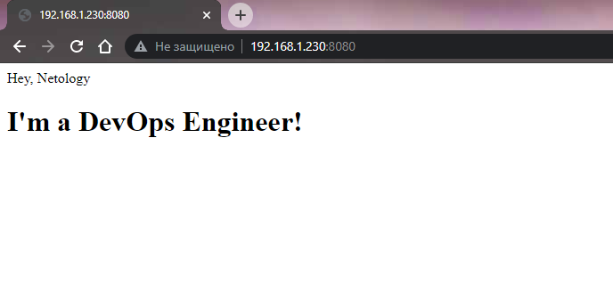

# Задача 1

_Сценарий выполнения задачи:_

- _создайте свой репозиторий на https://hub.docker.com;_
- _выберите любой образ, который содержит веб-сервер Nginx;_
- _создайте свой fork образа;_
- _реализуйте функциональность:_
_запуск веб-сервера в фоне с индекс-страницей, содержащей HTML-код ниже:_
```
<html>
<head>
Hey, Netology
</head>
<body>
<h1>I’m DevOps Engineer!</h1>
</body>
</html>
```
_Опубликуйте созданный форк в своем репозитории и предоставьте ответ в виде ссылки на https://hub.docker.com/username_repo._

Создадим Dockerfile и пропишем в нем команду `COPY` для копирования html-файла со стартовой страницей в контейнер.
```bash
root@ubuntu:/home/ubuntu/nginx-netology# nano Dockerfile
root@ubuntu:/home/ubuntu/nginx-netology# cat Dockerfile
FROM nginx:latest
COPY ./index.html /usr/share/nginx/html/index.html
root@ubuntu:/home/ubuntu/nginx-netology# nano index.html
root@ubuntu:/home/ubuntu/nginx-netology# cat index.html
<html>
<head>
Hey, Netology
</head>
<body>
<h1>I'm a DevOps Engineer!</h1>
</body>
</html>
```

Построим Docker-образ `webserver`:
```bash

root@ubuntu:/home/ubuntu/nginx-netology# docker build -t webserver .
Sending build context to Docker daemon  3.072kB
Step 1/2 : FROM nginx:latest
latest: Pulling from library/nginx
279a020076a7: Already exists
ef0e42ecde96: Pull complete
5b148f48f52e: Pull complete
5596027e469a: Pull complete
a7c9963870b9: Pull complete
efce21e16a59: Pull complete
Digest: sha256:1c13bc6de5dfca749c377974146ac05256791ca2fe1979fc8e8278bf0121d285
Status: Downloaded newer image for nginx:latest
 ---> 9c1ff20ac9c9
Step 2/2 : COPY ./index.html /usr/share/nginx/html/index.html
 ---> 9479f565e8fc
Successfully built 9479f565e8fc
Successfully tagged webserver:latest
```

Проверим что он корректно загрузился:

```bash
root@ubuntu:/home/ubuntu/nginx-netology# docker image ls
REPOSITORY                     TAG       IMAGE ID       CREATED          SIZE
webserver                      latest    9479f565e8fc   37 seconds ago   134MB
```

Запустим Docker-контейнер netology в фоновом режиме. Используем порт 8080 на хостовой машине:

```bash
root@ubuntu:/home/ubuntu/nginx-netology# docker run -it --rm -d -p 8080:80 --name netology webserver
f867467ed462a51b0255d03a12b3aa7c4adb64791701052545255ee70463e475
```



Добавим тег `latest` и опубликуем образ в Docker Hub:
```bash
root@ubuntu:/home/ubuntu/nginx-netology# docker image tag webserver marker689/webserver:latest
root@ubuntu:/home/ubuntu/nginx-netology# docker image push marker689/webserver:latest
The push refers to repository [docker.io/marker689/webserver]
0493df0238be: Pushed
dbfb7ebbfb94: Mounted from library/nginx
60a4b53ed3ec: Mounted from library/nginx
a3bf95fdc8f3: Mounted from library/nginx
4ac280c93de6: Mounted from library/nginx
96d4bf8b90c8: Mounted from library/nginx
5089aa3c97a8: Mounted from library/nginx
latest: digest: sha256:944d2711a7e000bbbc6e9c4dafbc2358e3b8810273fbf1742d3e74d54b43adee size: 1777

```

Образ опубликован по ссылке: https://hub.docker.com/r/marker689/webserver

## Задача 2

_Посмотрите на сценарий ниже и ответьте на вопрос:_

_"Подходит ли в этом сценарии использование Docker контейнеров или лучше подойдет виртуальная машина, физическая машина? Может быть возможны разные варианты?"_
_Детально опишите и обоснуйте свой выбор._

--

_Сценарий:_

- _Высоконагруженное монолитное java веб-приложение;_

Поскольку контейнеры поьзуются ресурсами хостовой операционной системы, у нас нет дополнительного слоя эмуляции аппаратного обеспечения, контейнер вполне может подойти для такого приложения. Если по каким-то причинам мы готовы отдать под него отдельный хост, то можно разместить его и на физической машине.

- _Nodejs веб-приложение;_

Я исхожу из предпосылки, что для практически всех веб-приложений контейнеры базово подходят, поскольку обеспечивают гораздо большую гибкость в масштабировании при увеличении нагрузки, если это необходимо. Плюс контейнер проще развернуть, чем виртуальную машину, а работать он будет быстрее.

- _Мобильное приложение c версиями для Android и iOS;_

Насколько я понял, Android предоставляет намного больше возможностей для контейнеризации, iOS же остается достаточно закрытой системой, с которой можно работать только в рамках, которые задает Apple. В этом случае эффективнее всего выбрать классическую виртуализацию с виртуальной машиной.

- _Шина данных на базе Apache Kafka;_

Подойдет Docker-контейнер, можем сконфигурировать Kafka в нем. Если нам нужно будет перенести шину на другие, более мощные серверы, мы можем перенести контейнер.

- _Elasticsearch кластер для реализации логирования продуктивного веб-приложения - три ноды elasticsearch, два logstash и две ноды kibana;_

У всех трех приложений есть образы в Docker Hub'е: https://hub.docker.com/_/elasticsearch, https://hub.docker.com/_/logstash, https://hub.docker.com/_/kibana

На мой взгляд, в таком варианте быстрее и проще поднять приложения в контейнерах, используя готовые образы. Плюс поскольку необходимо развернуть несколько нод приложений, это опять же будет быстрее сделать в стандартных контейнерах.

- _Мониторинг-стек на базе Prometheus и Grafana;_

По сути, оба приложения — это веб-приложения, для веб-приложений контейнеры подходят лучше всего. 

- _MongoDB, как основное хранилище данных для java-приложения;_

В Docker Hub'е есть образ приложения: https://hub.docker.com/_/mongo

В принципе, для баз данных контейнеры тоже неплохо подходят, нам может быть нужно распределить нагрузку и децентрализировать БД, для этого можно развернуть несколько стандартных stateful-контейнеров, которые будут сохранять в себе все данные после остановки.

- _Gitlab сервер для реализации CI/CD процессов и приватный (закрытый) Docker Registry._

Если у нас есть хост на Linux'е, удобно использовать контейнер, чтобы поднимать Gitlab-сервер. Если по какой-то причине это  Windows-based хост, тогда нужно будет вернуться к классической виртуализации.

## Задача 3

- _Запустите первый контейнер из образа ***centos*** c любым тэгом в фоновом режиме, подключив папку ```/data``` из текущей рабочей директории на хостовой машине в ```/data``` контейнера;_

Загрузим образ centos:
```bash
root@ubuntu:/home/ubuntu/nginx-netology# docker pull centos
Using default tag: latest
latest: Pulling from library/centos
52f9ef134af7: Pull complete
Digest: sha256:a27fd8080b517143cbbbab9dfb7c8571c40d67d534bbdee55bd6c473f432b177
Status: Downloaded newer image for centos:latest
docker.io/library/centos:latest
```

Попробуем запустить контейнер:

```bash
root@ubuntu:/home/ubuntu/nginx-netology# docker run -v /home/ubuntu/data:/data --name centos-container-1 -t -d centos
37a3a7188b8ea36a813eead2037a7a65f569d20f2d17bb878a9e6c6007437721
root@ubuntu:/home/ubuntu/nginx-netology# docker ps
CONTAINER ID   IMAGE                                 COMMAND                  CREATED          STATUS          PORTS    
37a3a7188b8e   centos                                "/bin/bash"              7 seconds ago    Up 6 seconds       
```

- _Запустите второй контейнер из образа ***debian*** в фоновом режиме, подключив папку ```/data``` из текущей рабочей директории на хостовой машине в ```/data``` контейнера;_

```bash
root@ubuntu:/home/ubuntu/nginx-netology# docker run -v /home/ubuntu/data:/data --name debian-container-2 -t -d debian
Unable to find image 'debian:latest' locally
latest: Pulling from library/debian
c7869242ae9a: Pull complete
Digest: sha256:10b622c6cf6daa0a295be74c0e412ed20e10f91ae4c6f3ce6ff0c9c04f77cbf6
Status: Downloaded newer image for debian:latest
10a7e46425a08038255097c9d95454968f205aeeffb5a50d40225f7d3f98d5b2
root@ubuntu:/home/ubuntu/nginx-netology# docker ps
CONTAINER ID   IMAGE                                 COMMAND                  CREATED          STATUS          PORTS       NAMES
10a7e46425a0   debian                                "bash"                   34 seconds ago   Up 23 seconds               debian-container-2
37a3a7188b8e   centos                                "/bin/bash"              2 minutes ago    Up 2 minutes                centos-container-1
```

- _Подключитесь к первому контейнеру с помощью ```docker exec``` и создайте текстовый файл любого содержания в ```/data```;_

```bash
root@ubuntu:/home/ubuntu# docker exec -it centos-container-1 /bin/bash
[root@37a3a7188b8e /]# cd data/
[root@37a3a7188b8e data]# touch file-in-centos
[root@37a3a7188b8e data]# echo "i am centos" > file-in-centos
[root@37a3a7188b8e data]# ls
file-in-centos
[root@37a3a7188b8e data]# exit
exit
```

- _Добавьте еще один файл в папку ```/data``` на хостовой машине;_

```bash
root@ubuntu:/home/ubuntu/data# nano file-in-host
root@ubuntu:/home/ubuntu/data# ls
file-in-centos  file-in-host
root@ubuntu:/home/ubuntu/data#
```

- _Подключитесь во второй контейнер и отобразите листинг и содержание файлов в ```/data``` контейнера._

```bash
root@ubuntu:/home/ubuntu/data# docker exec -it debian-container-2 /bin/bash
root@10a7e46425a0:/# cd data/
root@10a7e46425a0:/data# ls
file-in-centos  file-in-host
root@10a7e46425a0:/data# cat file-in-centos
i am centos
root@10a7e46425a0:/data# cat file-in-host
i am host
```