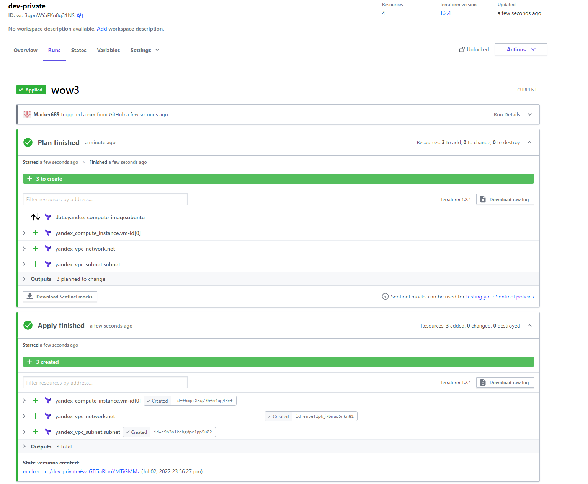

# Домашнее задание к занятию "7.4. Средства командной работы над инфраструктурой."

## Задача 1. Настроить terraform cloud (необязательно, но крайне желательно).

В это задании предлагается познакомиться со средством командой работы над инфраструктурой предоставляемым
разработчиками терраформа. 

1. Зарегистрируйтесь на [https://app.terraform.io/](https://app.terraform.io/).
(регистрация бесплатная и не требует использования платежных инструментов).
2. Создайте в своем github аккаунте (или другом хранилище репозиториев) отдельный репозиторий с
 конфигурационными файлами прошлых занятий (или воспользуйтесь любым простым конфигом).
3. Зарегистрируйте этот репозиторий в [https://app.terraform.io/](https://app.terraform.io/).
4. Выполните plan и apply. 

В качестве результата задания приложите снимок экрана с успешным применением конфигурации.

**Ответ:** 

Все ресурсы были успешно созданы:




---

## Задача 2. Написать серверный конфиг для атлантиса. 

Смысл задания – познакомиться с документацией 
о [серверной](https://www.runatlantis.io/docs/server-side-repo-config.html) конфигурации и конфигурации уровня 
 [репозитория](https://www.runatlantis.io/docs/repo-level-atlantis-yaml.html).

Создай `server.yaml` который скажет атлантису:
1. Укажите, что атлантис должен работать только для репозиториев в вашем github (или любом другом) аккаунте.
2. На стороне клиентского конфига разрешите изменять `workflow`, то есть для каждого репозитория можно 
будет указать свои дополнительные команды. 
3. В `workflow` используемом по-умолчанию сделайте так, что бы во время планирования не происходил `lock` состояния.

Создай `atlantis.yaml` который, если поместить в корень terraform проекта, скажет атлантису:
1. Надо запускать планирование и аплай для двух воркспейсов `stage` и `prod`.
2. Необходимо включить автопланирование при изменении любых файлов `*.tf`.

В качестве результата приложите ссылку на файлы `server.yaml` и `atlantis.yaml`.

**Ответ:** [server.yaml](./server.yaml)  [atlantis.yaml](./atlantis.yaml)
---

## Задача 3. Знакомство с каталогом модулей. 

1. В [каталоге модулей](https://registry.terraform.io/browse/modules) найдите официальный модуль от aws для создания
`ec2` инстансов. 
2. Изучите как устроен модуль. Задумайтесь, будете ли в своем проекте использовать этот модуль или непосредственно 
ресурс `aws_instance` без помощи модуля?
3. В рамках предпоследнего задания был создан ec2 при помощи ресурса `aws_instance`. 
Создайте аналогичный инстанс при помощи найденного модуля.   

В качестве результата задания приложите ссылку на созданный блок конфигураций. 

**Ответ:** 
В качестве готового модуля для `yandex.cloud` можно использовать [реализацию от hamnsk](https://registry.terraform.io/modules/hamnsk/vpc/yandex/latest).

В данном случае, лучше всего будет использовать напрямую `yandex_compute_instance`, так как лишние внешние зависимости только усложняют построение конфигурации.
Лучше всего будет взять за основу и переработать данный модуль "под себя". К тому же, из-за блокировки реестра terraform, использование модулей может быть затруднено.

Для инициализации данного модуля необходимо добавить следующий конфиг в main.tf

```terraform
module "yc-vpc" {
  name = terraform.workspace
  source  = "git@github.com:hamnsk/terraform-yandex-vpc.git?ref=v0.5.0"
  create_folder = false
  yc_folder_id = var.YC_FOLDER_ID
  yc_cloud_id = var.YC_CLOUD_ID
  nat_instance = true
  subnets = [
    {
      zone           = var.YC_ZONE
      v4_cidr_blocks = ["192.168.10.0/24"]
    }
  ]
}
```