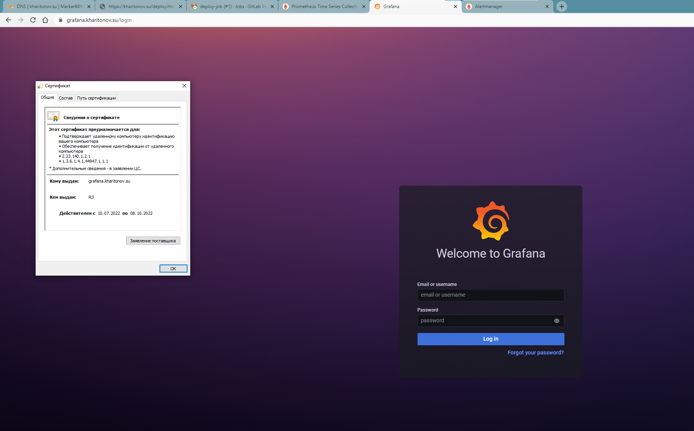

# Дипломный практикум в YandexCloud

## Регистрация доменного имени

- Зарегистрирован домен `kharitonov.su`;
- Настроено управление DNS для домена `kharitonov.su`;
>

Создан Workspace на `app.terraform.io`.
>

## Развертывание инфраструктуры
Развертывание инфраструктуры производится командой `terraform apply` из каталога `Terraform` данного репозитория:

- `providers.tf` Содержит настройки для подключения к провайдеру;
- `variables.tf` Содержит переменные;
- `network.tf` Содержит настройки сетей;
- `meta.txt` Содержит открытые ключи, которые будут создаваться в виртуальных машинах;
- `nginx.tf`, `gitlab.tf`, `monitoring.tf`. `mysql.tf`, `runner.tf`, `app.tf` Содержат манифесты для создания виртуальных машин в YC.
>
>

## Установка Nginx и LetsEncrypt
Все необходимые роли находятся в каталоге `ansible` и разделены по сервисам. В файле `hosts` находится inventory для playbook и переменные для ansible ssh proxy.

Первым следует выполнить playbook `nginx.yml`. Он установит и настроит `Nginx`, `LetsEncrypt`, на машину. Далеее запросит и получит необходимые сертификаты.

Для переключения между `stage` и `prod` запросами сертификатов следует отредактировать tasks с именем  `Create letsencrypt certificate` в файле `ansible\roles\Install_Nginx_LetsEncrypt\tasks\main.yml`, добавив или удалив в них флаг `--staging` :
```
- name: Create letsencrypt certificate front
  shell: letsencrypt certonly -n --webroot --staging -w /var/www/letsencrypt -m {{ letsencrypt_email }} --agree-tos -d {{ domain_name }}
  args:
    creates: /etc/letsencrypt/live/{{ domain_name }}
```

## Установка кластера MySQL

Теперь пора выполнить playbook `mysql.yml`. В файле `ansible\roles\Install_MySQL\defaults\main.yml` находятся настройки MySQL кластера. Дополнительно в файле `hosts` передаются переменные для настройки репликации базы  между db01 и db02. 


>

## Установка WordPress

Для установки `WordPress` служит playbook `wordpress.yml`.  Playbook устанавливает и настраивает `nginx`, `memcached`, `php7.4`, `wordpress`. В файле `wordpress.yml` так же передаются переменные, необходимые для корректной настройки wordpress.

```yml
  vars:
    - domain: "kharitonov.su"
    - download_url: "http://wordpress.org/latest.tar.gz"
    - wpdirectory: "/var/www"
```
>

Теперь сайт kharitonov.su доступен по https.

>

## Установка Gitlab CE и Gitlab Runner

Для установки Gitlab создан playbook `Gitlab`. Настройки данной роли вынесены в файл `ansible\roles\gitlab\tasks\main.yml`. Установка осуществляется с помощью Docker.

>

Теперь локальный `Gitlab` доступен по https.

>

Для установки Gitlab Runner следует выполнить playbook - `runner`. В файле `ansible\roles\Runner\templates\entrypoint.sh`  необходимо указать `url` (адрес сервера GitLab), а также `registration-token` (его можно узнать в интерфейсе гитлаба).  

Если все выполнено верно, Runner подключиться к Gitlab.

>


Для выполнения задачи deploy из GitLab в app.kharitonov.su была разработана следующая job:

```
before_script:
  - apt update
  - apt install ssh rsync -y
  - eval $(ssh-agent -s)
  - echo "$ssh_key" | tr -d '\r' | ssh-add -
  - mkdir -p ~/.ssh
  - chmod 700 ~/.ssh

stages:         
  - deploy

deploy-job:      
  stage: deploy
  script:
    - echo "Deploying application..." 
    - ssh -o StrictHostKeyChecking=no marker@app.kharitonov.su sudo chown marker /var/www/wordpress/ -R
    - rsync -vz -e "ssh -o StrictHostKeyChecking=no" ./* marker@app.kharitonov.su:/var/www/wordpress/
    - ssh -o StrictHostKeyChecking=no marker@app.kharitonov.su rm -rf /var/www/wordpress/.git
    - ssh -o StrictHostKeyChecking=no marker@app.kharitonov.su sudo chown www-data /var/www/wordpress/ -R
```

Для ее корректной работы необходимо наличие переменной с закрытым ключом, по которому осуществляется доступ к целевому серверу. Создадим ее:

>

Убедимся, что данная job выполняется верно.

>

>

По адресу [https://kharitonov.su/deploy.html](https://kharitonov.su/deploy.html) видим, что появился наш HTML-файл.

> 

Теперь при commit в репозитории GitLab изменения будут отправляться на сервер c wordpress(app.kharitonov.su).

## Установка Prometheus, Alert Manager, Node Exporter и Grafana

Для настройки данных служб следует использовать playbook `NodeExporter.yml`, который установит `Node Exporter` на хосты. А затем Playbook  `monitoring.yml`, он установит и настроит `Prometheus`, `Alert Manager` и `Grafana`. В файле `ansible\roles\monitoring\templates\prometheus.yml` содержаться настройки Prometheus. В файле `ansible\roles\monitoring\templates\rules.yml.j2` указываются обрабатываемые alert.

>

>

Интерфейс `Grafana`, `Prometheus` и `alertmanager` теперь доступны по https. Данные для входа в `Grafana` admin/admin.

>

>

>

Перейдя в интерфейс следует указать источник данных - Prometheus.

>

Импортировать шаблоны из каталога `templates_grafana`.

>

Теперь на `dashboard` Grafana доступны метрики со всех instance.

>

В alertmanager имееются правила для создания алертов.

>